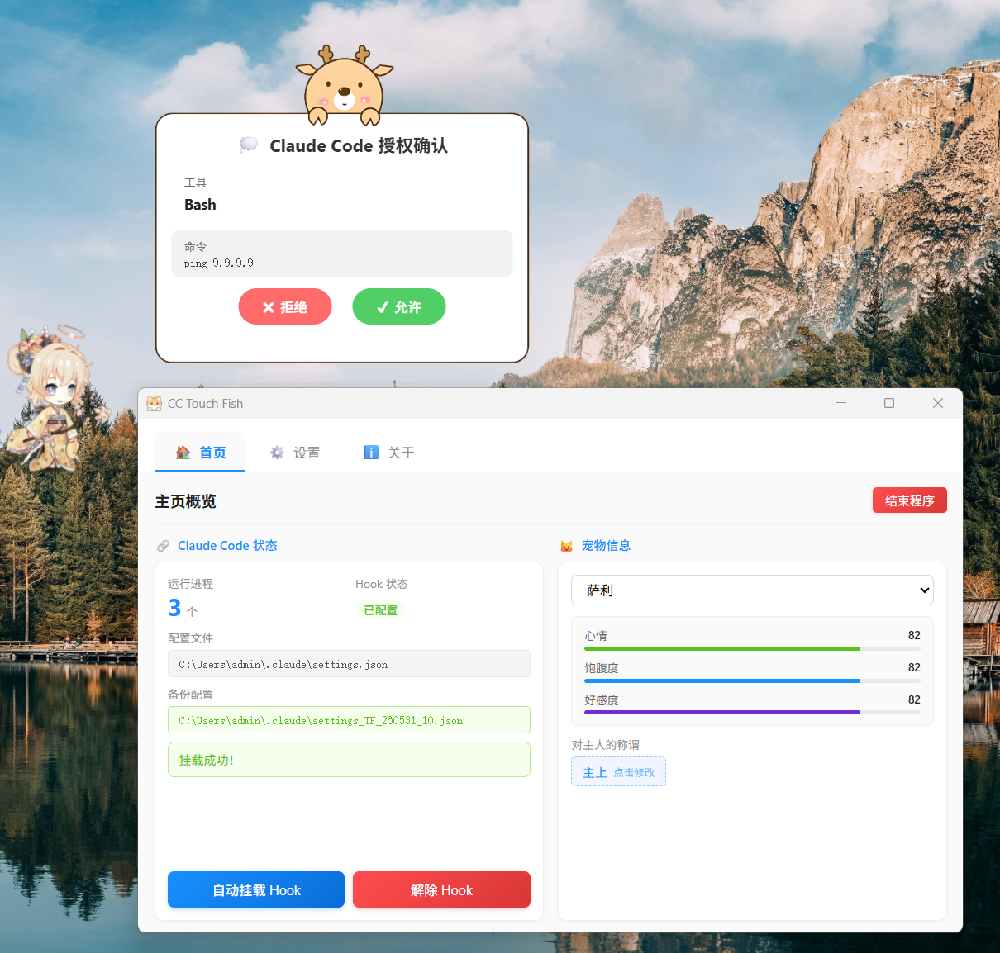

# CC Touch Fish

A desktop pet application with Claude Code integration, built with Tauri + React.



## Overview

CC Touch Fish is a lightweight desktop companion that lives in your system tray. It integrates with Claude Code's PreToolUse hook system to display approval dialogs when Claude Code attempts to execute potentially impactful commands, giving you full control over tool execution.
## Features

- **Desktop Pet Companion** - Animated sprite-based pets (Alice and Sally) with idle, hover, and click animations
- **Claude Code Integration** - Intercepts PreToolUse hooks to approve/deny tool execution requests
- **Approval Bubble** - Non-intrusive bubble window appears above the pet when approval is needed
- **System Tray** - Runs quietly in the system tray with quick access controls
- **Pet Stats System** - Track mood, fullness, and affection levels stored in local SQLite database
- **Transparency & Click-Through** - Configurable opacity and mouse穿透 settings
- **Auto-Mount Hook** - One-click setup to mount/unmount Claude Code hooks

## Screenshots

The app displays a cute animated pet in the corner of your screen. When Claude Code needs approval, a bubble window appears above the pet showing the command details.

## Tech Stack

- **Frontend**: React 18 + TypeScript + Pixi.js (for sprite animations) + Ant Design
- **Backend**: Rust + Tauri v2
- **Database**: SQLite (bundled via rusqlite)
- **HTTP Server**: Axum (for Claude Code hook communication)
- **State Management**: Zustand

## Requirements

- Windows 10/11
- [Claude Code](https://claude.ai/code) installed and configured

## Installation

### From Release

Download the latest `.exe` installer from the Releases page and run it.

### Build from Source

```bash
# Install dependencies
pnpm install

# Run in development mode
pnpm tauri-dev

# Build for production
pnpm tauri build
```

## Usage

1. **First Launch**: The app will open the settings window. Click "自动挂载 Hook" to register the PreToolUse hook with your Claude Code configuration.

2. **Pet Interaction**: The pet window stays on your desktop. Click on it to see different animations.

3. **Approval Flow**: When Claude Code encounters a tool that needs approval, a bubble will appear above the pet showing:
   - Tool name
   - Command to be executed
   - Working directory
   - Click "Approve" to allow or "Deny" to block

4. **Settings**: Right-click the system tray icon to access:
   - Toggle always-on-top
   - Open settings
   - About/Quit

## Architecture

```
┌─────────────────────────────────────────────────────────────┐
│                      Claude Code                            │
│                   (PreToolUse Hook)                        │
│                            │                                │
│                            ▼                                │
│              http://localhost:10425/tf-pretooluse           │
└─────────────────────────────────────────────────────────────┘
                              │
                              ▼
┌─────────────────────────────────────────────────────────────┐
│                    CC Touch Fish App                         │
│  ┌─────────────┐  ┌─────────────┐  ┌─────────────────────┐ │
│  │ Main Window │  │   Bubble    │  │   Settings Window   │ │
│  │  (Pet)      │  │  (Approval)│  │   (Config)          │ │
│  └─────────────┘  └─────────────┘  └─────────────────────┘ │
│                            │                                │
│                            ▼                                │
│                    SQLite Database                          │
│                  (Pet Stats & State)                        │
└─────────────────────────────────────────────────────────────┘
```

## Project Structure

```
cc-touch-fish/
├── src/                    # React frontend
│   ├── components/         # UI components
│   │   ├── PetCanvas.tsx   # Pixi.js pet renderer
│   │   ├── ApprovalModal.tsx
│   │   ├── SettingsWindow.tsx
│   │   └── HomePage.tsx
│   ├── stores/             # Zustand state
│   ├── data/                # Pet sprite data
│   └── App.tsx              # Main app logic
├── src-tauri/              # Rust backend
│   └── src/
│       ├── commands.rs      # Tauri commands
│       ├── http_server.rs   # Axum HTTP server
│       └── lib.rs           # App initialization
└── public/                 # Static assets
```

## Future Roadmap

- [ ] **Cross-platform Support** - macOS and Linux builds
- [ ] **More Pets** - Additional pet sprites and customization options
- [ ] **Pet Interactions** - Mini-games, feeding, and grooming features
- [ ] **Notification System** - Desktop notifications for approvals when window is minimized
- [ ] **Dark Mode** - Settings window dark theme support
- [ ] **Custom Hook Matching** - Configure which tools require approval
- [ ] **Pet Evolution** - Visual pet changes based on stats over time
- [ ] **Multi-language Support** - i18n for settings and UI
- [ ] **Statistics Dashboard** - Track Claude Code usage patterns
- [ ] **Plugin System** - Extensible pet behaviors and integrations

## License

MIT

## Contributing

Contributions are welcome! Please feel free to submit issues and pull requests.
